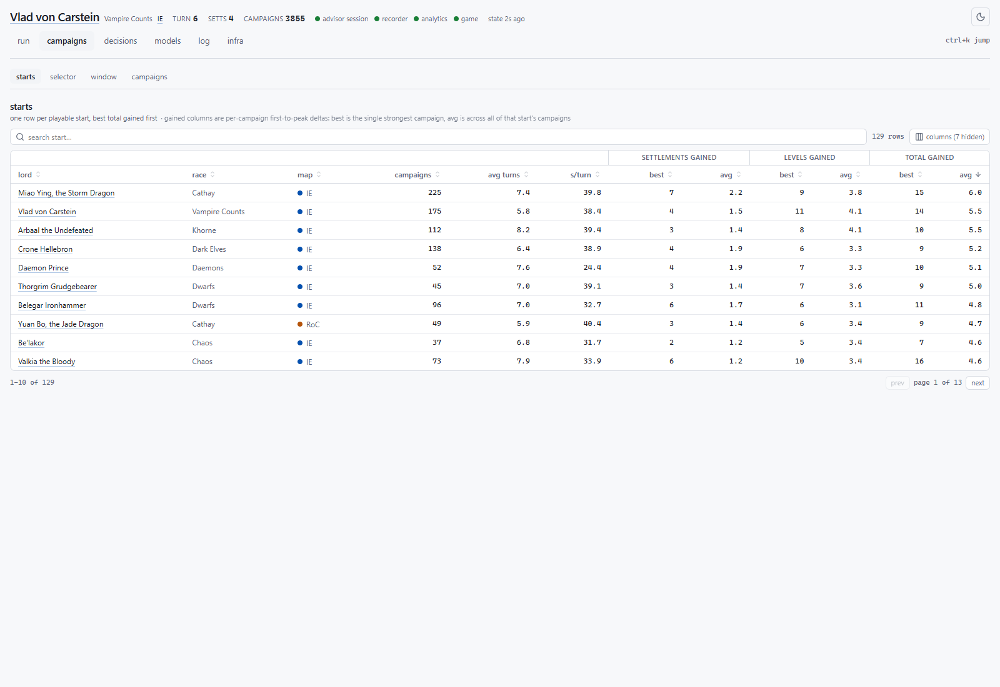
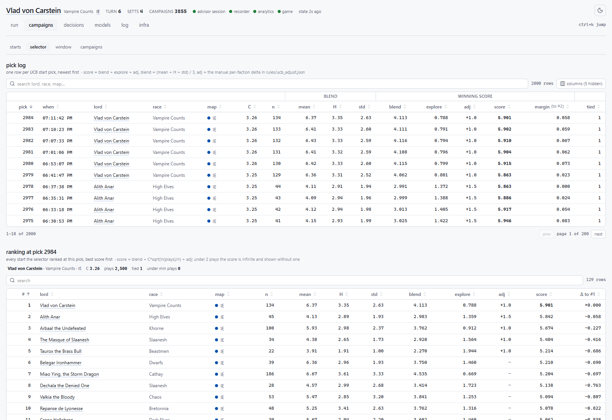
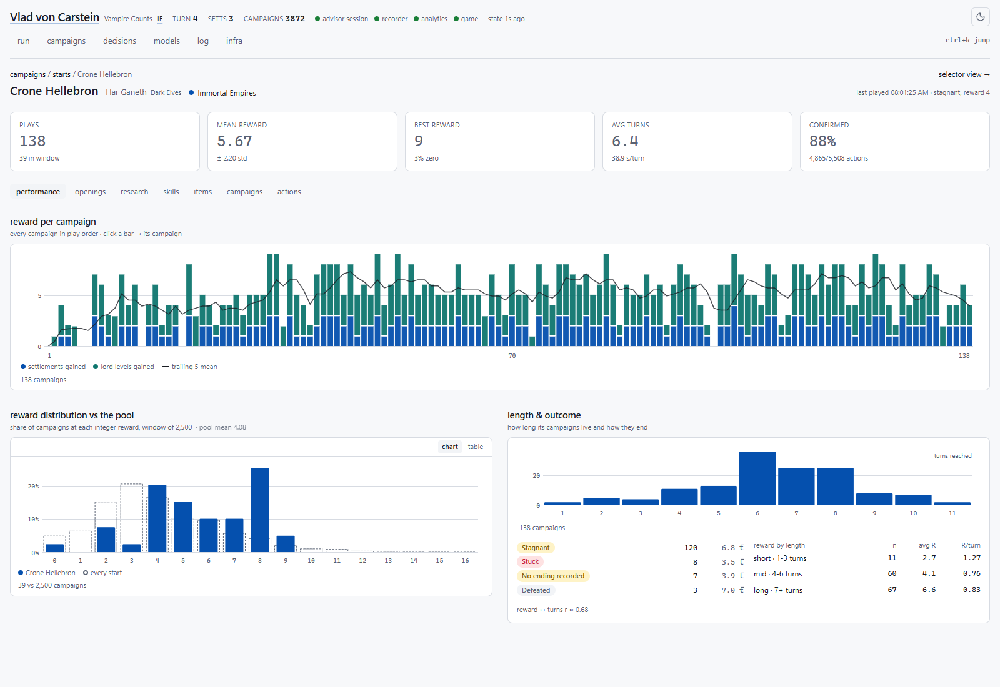
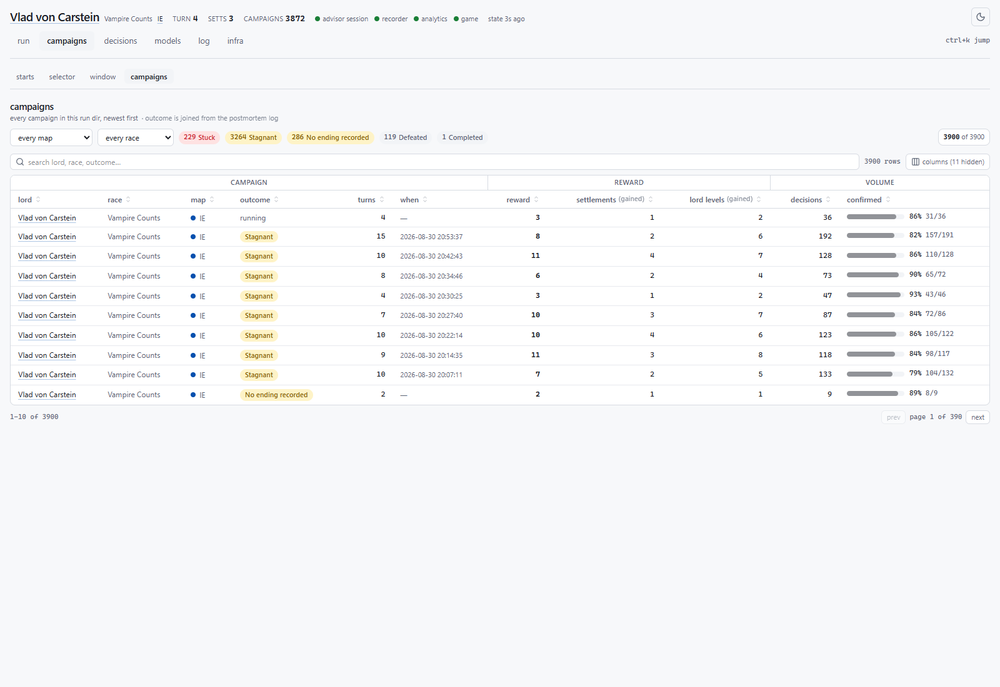
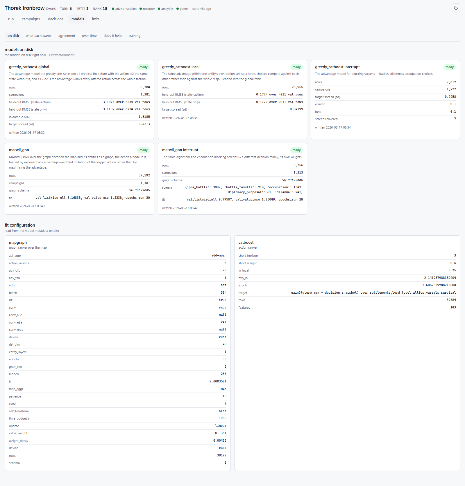

# tw_stack

An agent that plays Total War: Warhammer III campaigns on its own, records every decision it
makes in a form that can be learned from, and trains ranking models on the result.

The game has no API. Everything here is built on one narrow channel: a Lua mod compiled into
the game's own pack, talking to Python over a file command bus. That constraint shapes the
whole design — the interesting problems are not "what move is best" but "what can be read
from the game reliably, what can be executed and verified, and how do you know the record
you kept is true".

## What it does

A run plays N campaigns of up to T turns each. For every turn the agent:

1. reads the campaign state through the bus,
2. generates the legal actions available right now — recruit, move, attack, build, research,
   diplomacy, rites, stances, hero actions, and a dozen more,
3. ranks them with a model and picks one,
4. executes it through the UI and **verifies it landed**,
5. handles whatever the game interrupts with — battles, dilemmas, occupation choices,
   diplomatic offers, event popups.

Everything above is recorded: the state, the full option set, the score each option got, the
one taken, and whether the game confirmed it. That record is the product. The models are
downstream of it.

## Structure

Six components, one direction of data flow. `ARCHITECTURE.md` has the detail.

| | |
|---|---|
| **bus** | the Lua mod and the file command bus. The only thing that talks to the game. |
| **manager** | the recorder. Owns every bus read and every database write. |
| **launcher** | the driver. Game lifecycle, the executor registry, navigation, interrupts. |
| **advisor** | the backend. Plays the campaign, ranks actions, trains the models. |
| **advisor_api** | a typed JSON API over the corpus, and the server for the dashboard. |
| **ui** | the dashboard. React + Vite, types generated from the API's OpenAPI document. |

Supporting: `decisions` (schema and collection), `campaigns` (campaign-boundary splitting),
`analytics` (materialised aggregates), and the `input` / `shots` / `logs` / `ui-capture`
recorder streams.

## The models

Two learned rankers compete inside one strategy portfolio, alongside a hand-written
ruleset and a random arm, so the corpus keeps a coverage tail while the models take over:

- **greedy_catboost** — CatBoost on an E1/E2 advantage formulation, global and local.
- **greedy_gnn** — a graph encoder over the campaign (factions, regions, armies and the
  relations between them) with a reward head: one regression of the return
  per action node, fit by MSE on the action that was taken; the arm plays the argmax. No
  state-only model, no advantage, no value head.

Blocking screens (pre-battle, occupation, dilemmas, diplomacy) are their own decision
family with their own mix (`--interrupt-strategies`): `greedy_catboost` has an interrupt
model, `random` and `ruleset` need none, and the graph arms have no interrupt model.

Campaigns are abandoned early when they stop growing, so the run spends its time on
trajectories that are still going somewhere rather than on 20 turns of nothing.

The trainable arms are hard dependencies: a missing or broken model stops the run rather
than silently playing random in its place, and retraining only happens when asked
(`--retrain-every N`). The operating rules the run is held to — throughput, lifecycle,
waits, screen handling — live in `CLAUDE.md`.

## Requirements

- Total War: WARHAMMER III, installed and run once so its settings file exists
- Python 3.11+ (3.13 here; `tomllib` is used to read the config)
- Node LTS, for the dashboard client
- An NVIDIA GPU with a CUDA build of torch — the graph models train on CUDA, and a CPU-only
  torch wheel leaves `greedy_gnn` unable to retrain (the session refuses
  rather than degrading silently)

## Setup

    git clone <repo> tw_stack && cd tw_stack

    py -3.13 -m venv .venv
    .venv/Scripts/python -m pip install -r requirements.txt
    cd ui && npm install && cd ..

    python doctor.py

`doctor.py` prints every machine-dependent path, where each one came from, and what to do
about any it could not find. If it says `all paths resolve`, there is nothing to configure.

It usually does. Two paths are machine-dependent and each is resolved as
**environment variable → `config.toml` → autodetection → default**:

| | env | found by |
|---|---|---|
| the game install | `TW_GAME_DIR` | scanning the usual Steam library locations |
| everything a run produces | `TWDATA` | a `twdata` folder beside the checkout |

The checkout always owns `.venv`. Generated data, including the live file bus, belongs
under `TWDATA` outside the checkout; the bus uses `<TWDATA>/bus`.

Only if one is missing: `cp config.example.toml config.toml` and set it. `config.toml` is
not in git, so each machine keeps its own.

The lua mod is compiled into the game's pack format and cannot read any of this at
runtime, so `bus/pack_multi.py` bakes the bus paths in when it builds the pack — and fails
rather than shipping a pack pointing at the machine that last built it.

## Running it

    python runctl.py up                  # the configured run: run_config.RUN

`run_config.RUN` is the authoritative description of the run — campaigns, turns, the
strategy mix, ruleset, campaign-map mix, presave radius, retrain cadence. `runctl up`
starts four processes: the recorder, the API on `:8777`, the analytics roller, and the
play session. It builds and installs the mod pack, boots the game, and drives it from
there — nothing else to click. Any RUN value can be overridden per launch, e.g.:

    python runctl.py up 500 20 --campaign "Realm of Chaos=0.5,Immortal Empires=0.5" \
        --strategies greedy_catboost=0.3,greedy_gnn=0.3,random=0.4 \
        --interrupt-strategies greedy_catboost=0.5,random=0.5 \
        --factions all --presave-radius 150

Models are chosen only through the two mixes — `--strategies` for actions,
`--interrupt-strategies` for blocking screens; there is no model flag (the exploit scorer
that ranks every offer is fixed — `advisor/backends.py` is its registry). `--epsilon`,
`--retrain`, `--cfg`/`--nn-*` were removed and are rejected with pointers to their
replacements.

    open http://127.0.0.1:8777          # watch it
    python runctl.py harness            # supervise: kill and relaunch a dead, stalled,
                                        # or non-progressing session, same config
    python runctl.py down               # stop everything

The run is engineered for throughput measured in turns per hour, wall-clock honest:
campaigns kill the game the moment their fate is sealed and the next boots fresh, stalls
end campaigns in seconds instead of being waited out, and every wait in the stack logs
its use and outcome with ISO timestamps. `CLAUDE.md` states these rules precisely.

## The dashboard on its own — a manual run tracker

The game dashboard is useful without the rest of the stack: no advisor session, no
models, no selector — just the mod feeding the recorder, the recorder feeding postgres,
and the dashboard reading it. That combination tracks a game you play yourself.

    python runctl.py dashboard             # view an existing corpus, model-free
    python runctl.py dashboard --record    # also start the recorder, then boot the game
                                           # yourself with the mod pack installed

The **default dashboard** is what every viewer lands on, and it carries game
information only: campaigns and starts, campaign detail with its buildings / research /
skills / items tabs, the campaign lookup with its reward-weights tab, the item /
building / research / skill catalog, and service status. Everything produced by the
programmatic runner — run health, the decision log, the positions breakdown of the
advisor's own moves, the session log, the selector, the model pages and the launch
controls — is the **dev dashboard**, behind the flask button in the header, off until
clicked and remembered per browser. Dashboard-only mode (`--dashboard` on
`advisor_api.app`, or `TW_DASHBOARD_ONLY=1`) removes that button entirely, so a shared
instance can never show the dev side.

What it needs: postgres reachable (`TW_PG_*`, see `decisions/pg.py`), the reference
schema loaded for localized names, and — for `--record` — the compiled mod pack
installed so the game feeds the bus. `python doctor.py` checks all of it.

`python ui_docshots.py` regenerates these from the live UI (API must be up).

The run screen — live throughput against the 60 turns/hour floor, services, per-stage
timing, and the session log:

The experiment ledger — every trial and every retrain, with what it played and what came
of it:

The decision log — every action the run took, what the stored rankings made of it,
and which arm picked it:

One decision, drilled in — where its milliseconds went, how the arms ranked it, and
the full scored offer list with the taken row marked:

The starts — the presave pool as the UCB selector sees it over its trailing window:
plays per start, the mean × entropy plane the blend is scored on, reward and turn
distributions by map, reward by race, and one row per start with its window stats,
blend, explore, score and rank:

The selector — every UCB pick in order: the winning blend + explore, coverage and
concentration over time, pick lanes per start, expected vs realised reward, the ranking
behind any pick, and the pick log:

One start, drilled in — its reward per campaign, its reward distribution against the
pool, where the selector ranked it at every pick, its campaigns and its action types:

Every campaign — one row per campaign played, its outcome, reward and volume:

The models on disk — what is trained right now, with its fit metrics and configuration:

## Where things live

Code is here. Everything a run produces lives under `TWDATA` — run directories and the
`CURRENT_RUN` pointer, fitted models, the offline game-data reference, service logs and
archives. Nothing in this repository is generated by a run, and nothing generated is
written into it.

`rules/` is the exception, and it is here on purpose: a rule set decides how the agent
plays, so it is an input, not an output, and a run is not reproducible on another machine
if it lives elsewhere. `<TWDATA>/rules/` is searched first if you want to try a variant
without editing the checkout.
